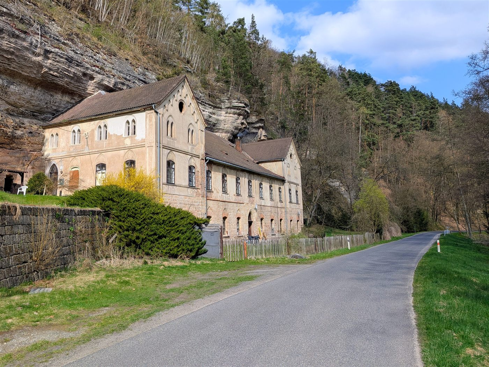
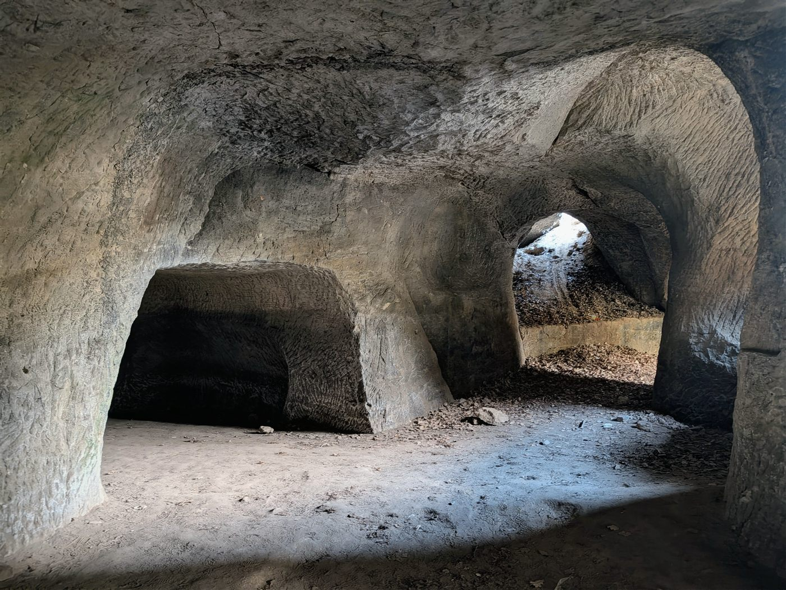
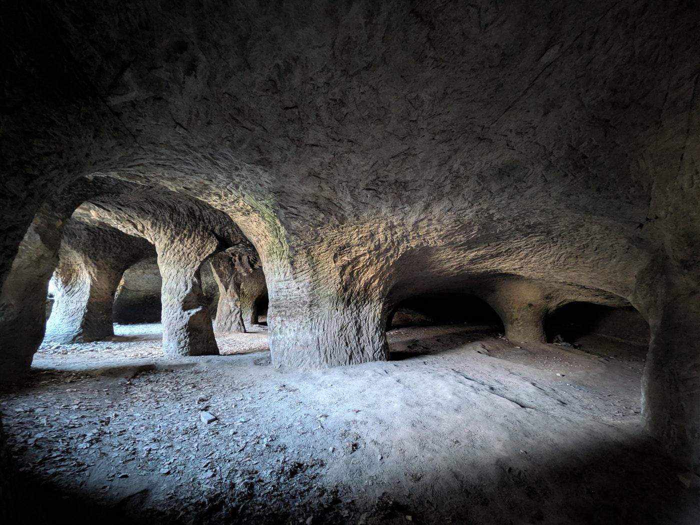
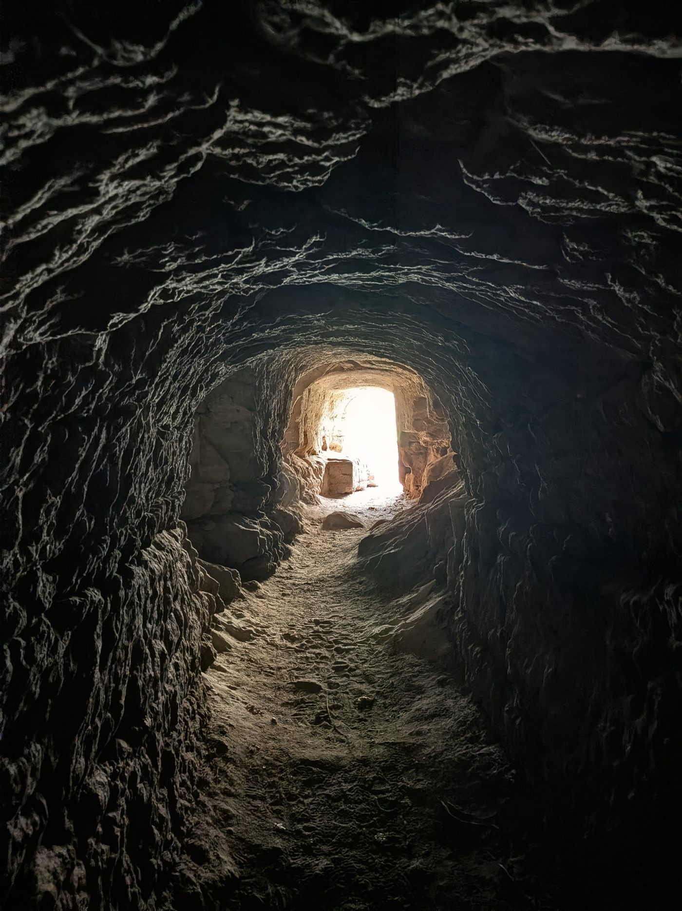
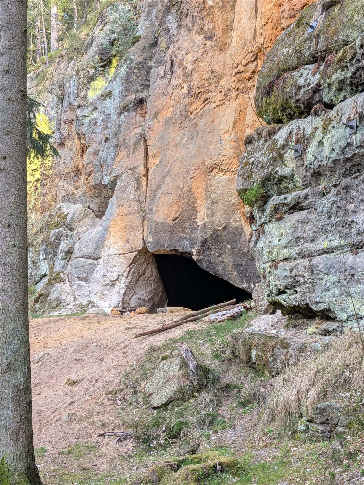
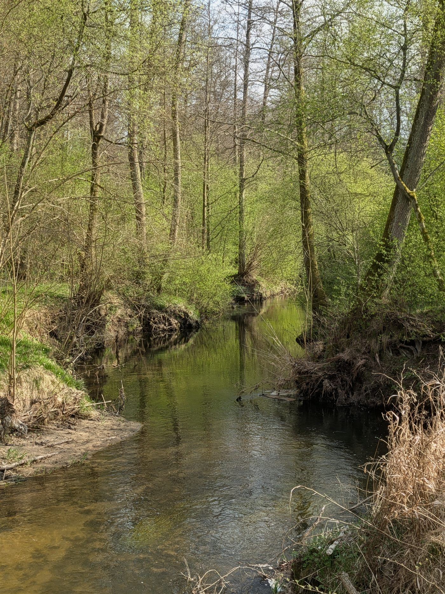
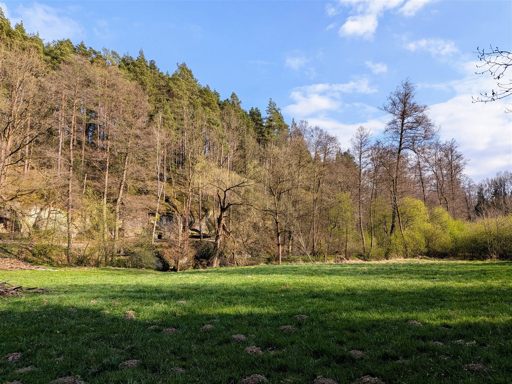

# Psí kostely a Tiché údolí

## Přístup

Parkování na širokém začátku lesní cesty u silnice mezi Velenicemi a Svitavou, kousek od Velenické zrcadlovny.

## Popis cesty

Krátká procházka. Nejprve zastávka v Psích kostelech, pak cestou po levém břehu říčky Svitavky do Tichého údolí. Cesta vede kolem dramatických skalních stěn a několika jeskyní. Je tu přístup do starého podzemního náhonu k zrcadlovně. Ve skalních chodbách jsou rozmístěné svíčky, celý podzemní prostor asi často využívají trampové a skauti. Na konci cesty řeka krátce teče podzemní skalní průrvou.

## Body zájmu

- **Psí kostely:** skalní útvar, zastávka na začátku trasy.
- **Skalní stěny a jeskyně:** podél levého břehu Svitavky.
- **Podzemní náhon:** starý přivaděč vody k Velenické zrcadlovně, přístupný ze skalních chodeb.
- **Skalní průrva:** na konci cesty řeka krátce teče podzemím.

## Fotky

