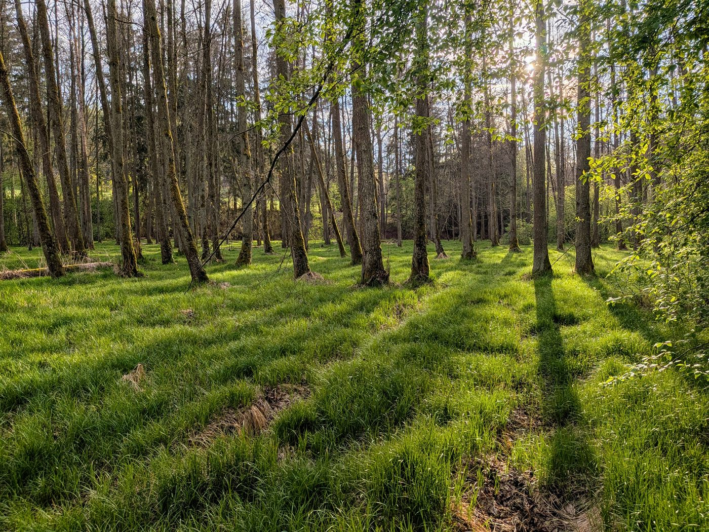
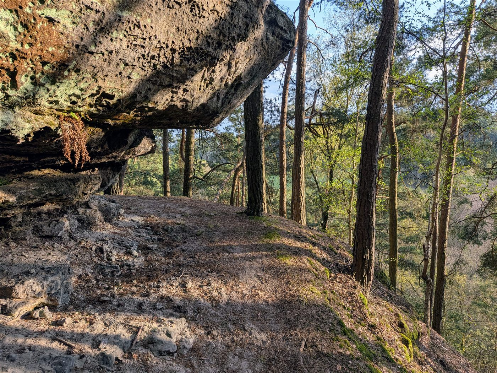
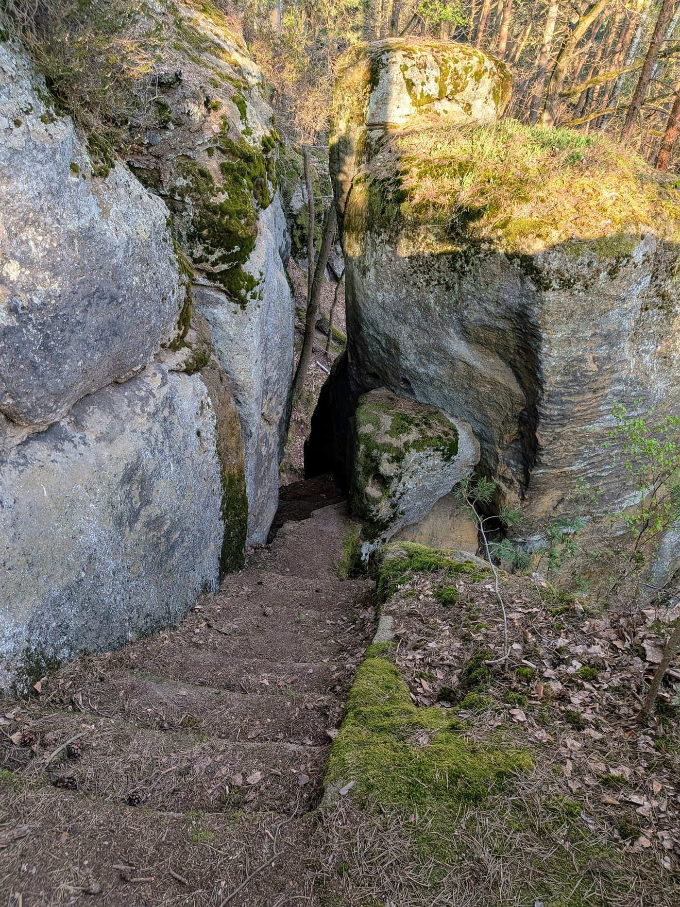
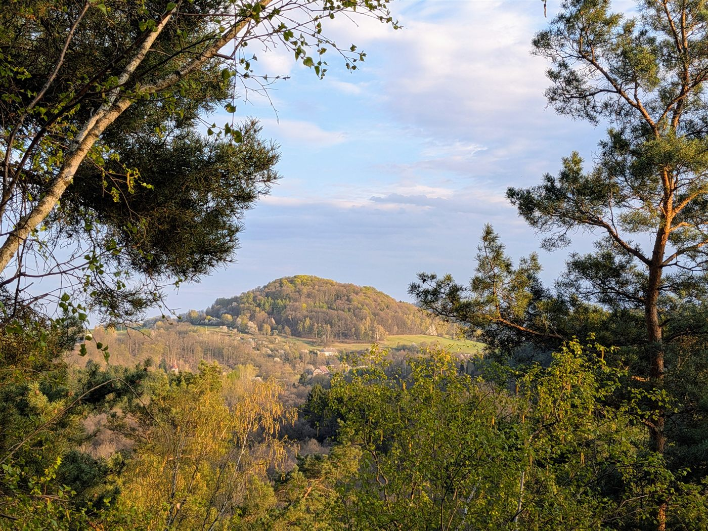
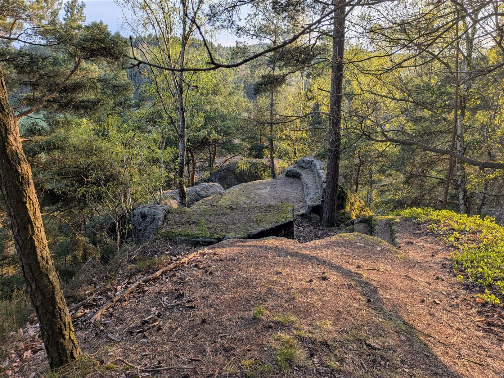
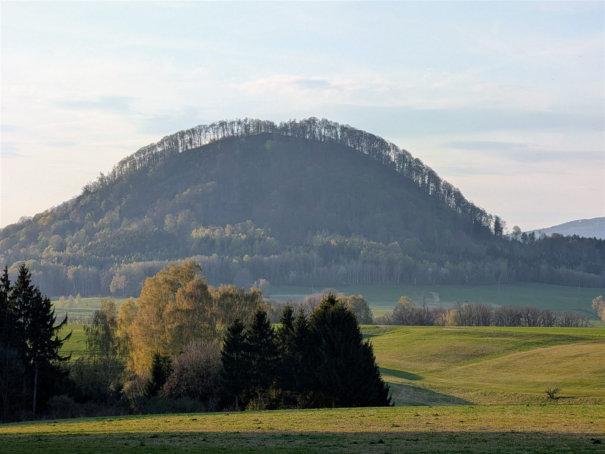
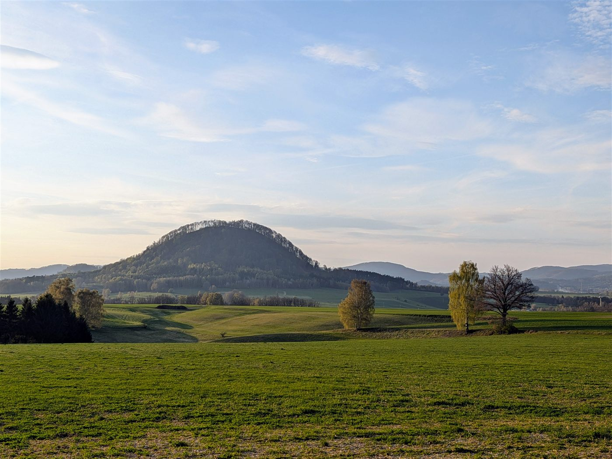

# Rabštejnská vyhlídka

## Přístup

Autem k parkovišti na začátku lesní cesty pod vyhlídkou, nad bývalou zrcadlovnou Rabštejn u Velenic. Tři možné příjezdy:

- přes Zákupy a Velenice,
- od Svojkova přes Svitavu,
- od Cvikova přes Lindavu a Svitavu.

## Popis cesty

Zaparkoval jsem na začátku lesní cesty pod vyhlídkou a špatně znatelnou cestou vylezl nahoru. Cesta je velmi příkrá, místy je potřeba pomoc rukou, za mokra či sněhu je nevhodná.

Z vyhlídky už skoro není rozhled, stromy jsou moc vysoké. Vidět je jen Velenický kopec s několika chalupami na úpatí. V minulosti byla vyhlídka zřejmě populární: vedou na ni staré schody vytesané v pískovcové spáře mezi dvěma pískovcovými věžemi a na vrcholu je v pískovci vytesaná lavice s opěradlem. Schody jsou už tak vyšlapané, že je prakticky nejde použít.

Zpátky jsem šel delší, mnohem pohodlnější cestou s nádherným výhledem na Ortel a kopce za Cvikovem, později na Brnišťský vrch.

## Body zájmu

- **Rabštejnská vyhlídka:** staré tesané schody v pískovcové spáře mezi dvěma věžemi, tesaná lavice s opěradlem na vrcholu. Rozhled je dnes zarostlý.
- **Výhledy ze sestupové cesty:** Ortel, kopce za Cvikovem, Brnišťský vrch.

## Fotky

